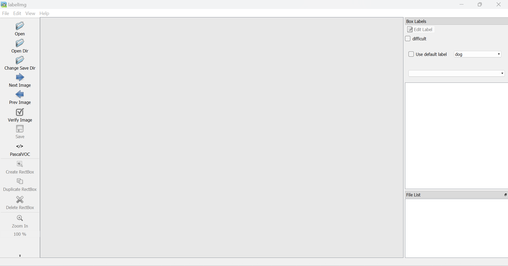
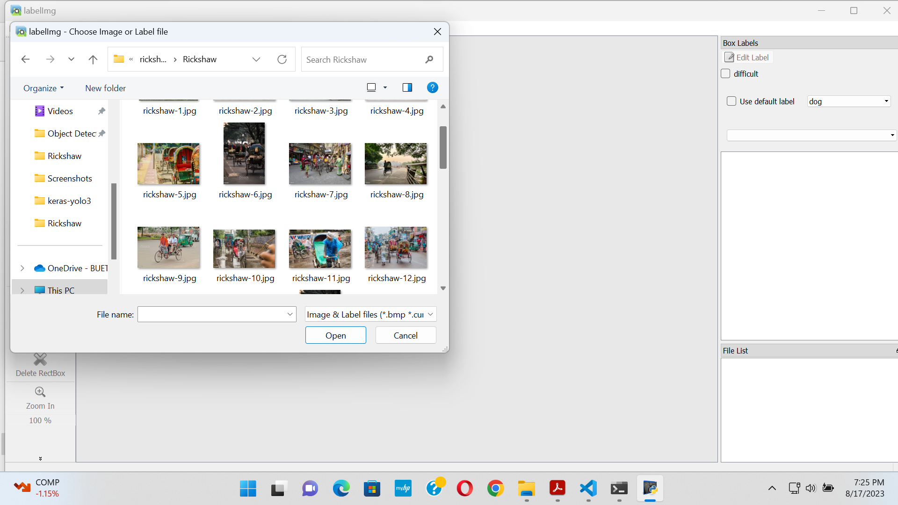
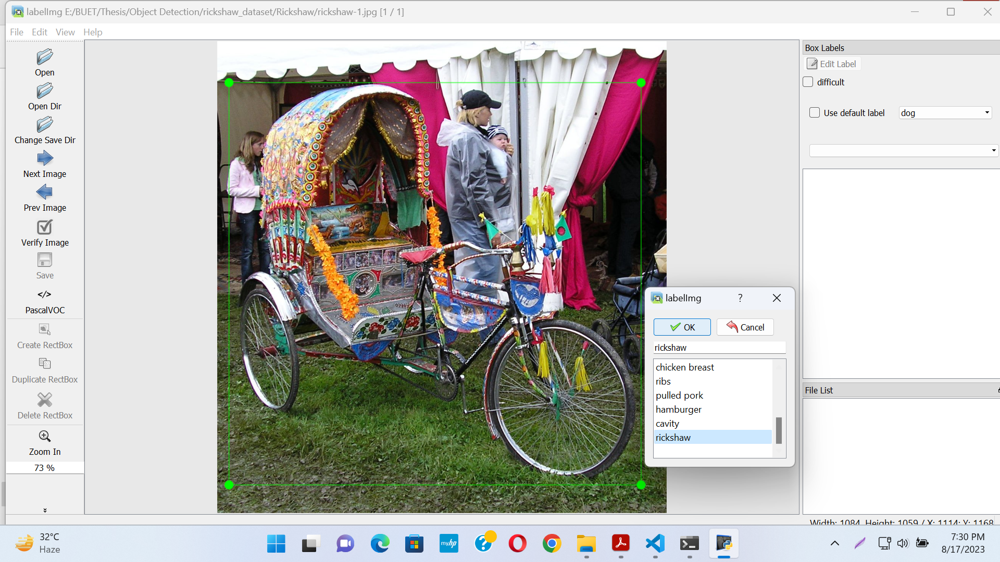
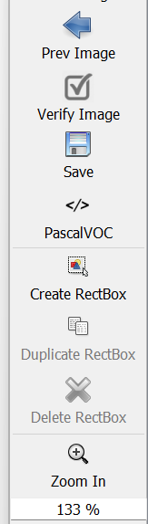
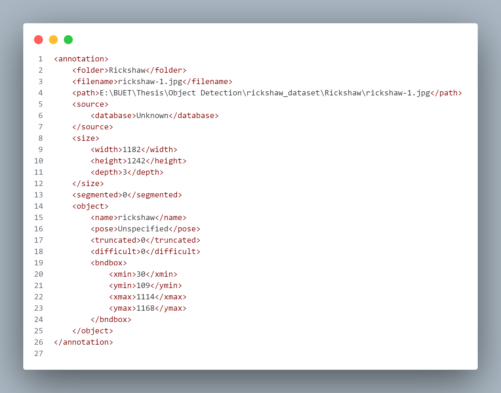

# How to install labelImg on Windows
This repository is not currently maintained . That's why it is very difficult to install on windows.
The process to install on windows is given below.
## Prerequisite
- Step 1 : Install ***Python 3.0*** or above.
- Step 2 : Install ***PyQt5*** .
- Step 3 : Install ***lxml***.
  
### Installing *PyQt5*
This is the hardest part on windows.

1. Go to [this](https://sourceforge.net/projects/pyqt/files/PyQt5/) website to download.
2. Check each folder for your python version. Such as
   ```
   PARENT FOLDER : PyQt-5.6
   INSIDE : PyQt5-5.6-gpl-Py3.5-Qt5.6.0-x64-2.exe
   ```
 3. `PyQt5-5.6-gpl-Py3.5-Qt5.6.0-x64-2.exe` This means it is for python 3.5 and 64 bit.
 4. Download this according to your python version and install it.
   
### Installing *lxml*
1. Go to [this](https://lxml.de/installation.html#installation) website and follow.
   ```
   pip install lxml 
   ```

## Download *labelImg*
1. Clone the repository from [github](https://github.com/HumanSignal/labelImg).
    ```
    git clone https://github.com/HumanSignal/labelImg.git
    ```
## Installing *labelImg*

1. Go to the repository folder on your machine and open *cmd* or any terminal there.
   ```
   cd labelImg
   ```
2. Run this line of code(*this is only for PyQt5*).
   ```
   pyrcc5 -o libs/resources.py resources.qrc
   ``` 
3. This should install *labelImg*.
   
## Code Modification

1. Go to ***labelDialog.py*** file. The path should be ``labelImg\libs\labelDialog.py`` . 
2. Inside this file modify this line of code 
   ```
   layout.addWidget(bb,alignment=Qt.AlignmentFlag.AlignLeft)

   ```
    **TO**
    ```
    layout.addWidget(bb, alignment=Qt.AlignLeft)

    ```
3. If you find ``Qt.AlignmentFlag.AlignLeft`` just remove the ``AlignmentFlag`` and change it to `Qt.AlignLeft`
   (*in place of alignment there may be something else*).
4. Save the modified file(s).
   
## Run *labelImg*
1. You have to run this applicaiton inside the *labelImg* folder.
    ```
    python labelImg.py
    ```
2. This will open the app.
   

## Add Own Class
1. Go to the file `predefined_classes.txt` . The path should be `labelImg\data\predefined_classes.txt` 
2. Add your calss name in this file.
    ```
    dog
    person
    cat
    tv
    car
    meatballs
    marinara sauce
    tomato soup
    chicken noodle soup
    french onion soup
    chicken breast
    ribs
    pulled pork
    hamburger
    cavity
    rickshaw     //add your class name here
    ```

## Demo

- Open / Open Dir (*Open Dir will enable Next Image*). Select image or folder.
  
  
  
-  Create *RectBox* around your object and the class.
  
  

- You change your save directory.
  
   

- Change save format to *PascalVOC* to save as *XML*.
  
   


## Author
- [Abdullah Al Fahad](https://github.com/alfahadarc)